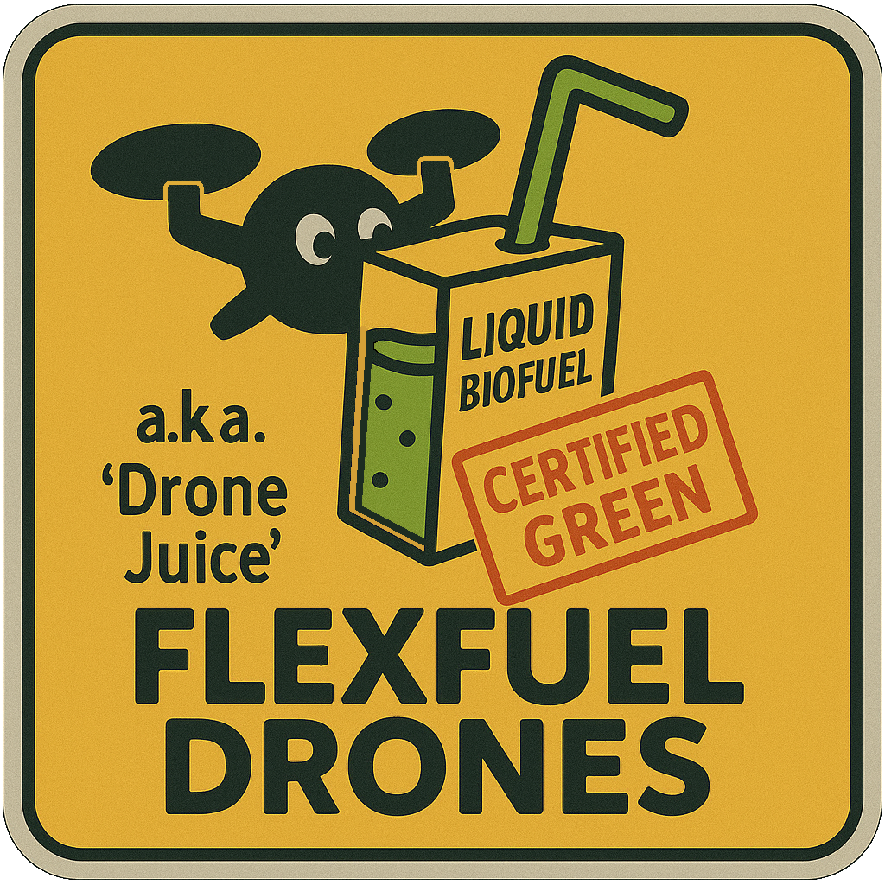

# FlexFuel Drones – A Satisfactory Mod

**FlexFuel Drones** (aka "Drone Juice") is a lightweight Satisfactory mod that enables Drones to use **Packaged Liquid Biofuel** as a valid fuel source — because who says drones can’t go green? (Oh yeah, that's right... Coffee Stain Studios did! Whoops!)

## 🚀 Features

- Adds **Packaged Liquid Biofuel** to the list of compatible drone fuels.
  - "FlightSpeed" and "TravelSpeed" are set to match batteries. Seemed fitting since they're both "green"...ish.
  - Burn rate / fuel usage is just under half way between "regular" fuel and turbofuel. (I didn't see anywhere to edit this, so that happened "naturally.")
- Seamlessly integrates with the base game thanks to the awesome [ContentLib](https://ficsit.app/mod/ContentLib) mod made by Nogg-aholic and Robb! (Thanks, guys!)
- No additional configuration required – just install and play! When you unlock drones (or if you already have), this update will be ready for you!

## 🛠 Requirements

- Satisfactory *1.0*! (Yes, the stable version. I don't have a version ready for 1.1 yet -- stay tuned!)
- [Satisfactory Mod Manager](https://ficsit.app/)
- [ContentLib](https://ficsit.app/mod/ContentLib)
- Game version: Compatible with Update X and newer

## 📦 Installation

1. Open the Satisfactory Mod Manager.
2. Search for **FlexFuel Drones** and install it.
3. Launch the game and enjoy putting those piles of leaves, wood, 'shrooms, and creature guts to good use in your drone logistics!

## 💡 Notes

- This mod modifies the **Drone Station’s** fuel compatibility list by editing the CDO (Class Default Object) using ContentLib.
- Other than that, the mod does not interfere with base-game balance or performance.

## 🔧 Development & Modding Docs

Want to rebuild this mod from scratch or see how it works behind the scenes? You're welcome to explore and tinker!

- [Satisfactory Modding Docs – Beginner's Guide](https://docs.ficsit.app/satisfactory-modding/latest/Development/BeginnersGuide/index.html)
- [ContentLib Documentation](https://docs.ficsit.app/contentlib/latest/index.html)

If you're just here to play, the easiest route is to install the mod via [Satisfactory Mod Manager](https://ficsit.app/).

## 📝 License

This project is licensed under the **Unlicense**, a license that dedicates the work to the public domain.

You're free to use, modify, share, or build upon this project however you'd like — no attribution required.

That said, if you end up using this mod as a learning reference or springboard for your own awesome creation, I’d love to hear about it!

> Full license text: [Unlicense.org](https://unlicense.org/)

## 🔗 Mod Page

Check out **FlexFuel Drones** on FICSIT.app here:  
➡️ [https://ficsit.app/mod/your-mod-id-here](https://ficsit.app/mod/your-mod-id-here) 

## 📸 Icon

## 🤝 Credits

- Mod Author: Boswen McBastok
- Made possible by: The work of Robb + Nogg-aholic on ContentLib.
- Thanks to the amazing Satisfactory Modding community (seriously, the community Discord is awesome!) and the devs behind the Satisfactory Mod Manager team!

## 📬 Feedback & Support

Feel free to open an issue on this repo or ping me on Discord via the Satisfactory Modding Discord if you have questions, ideas, or bugs to report!

---
“Certified Green” – one sip at a time.
